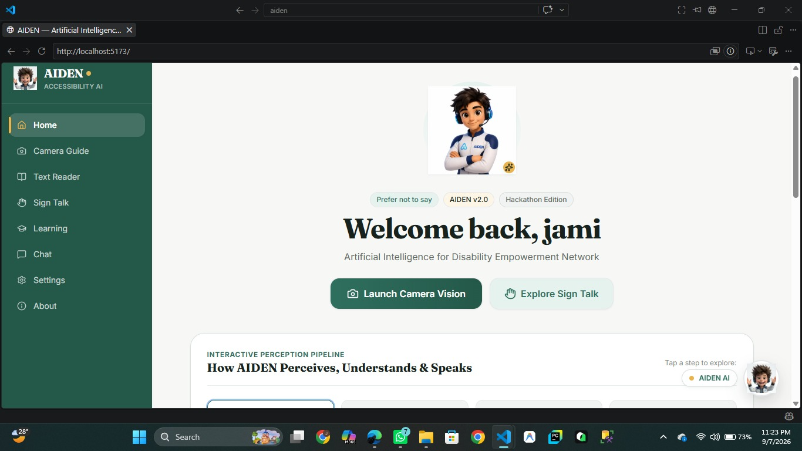
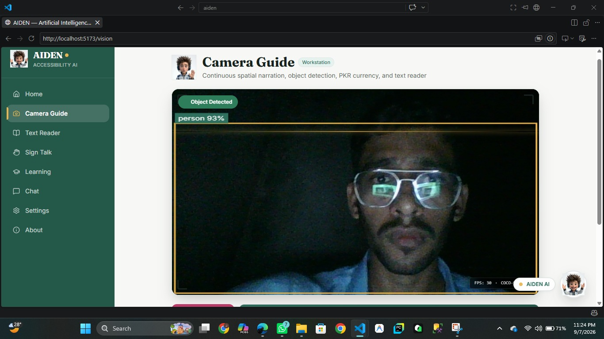
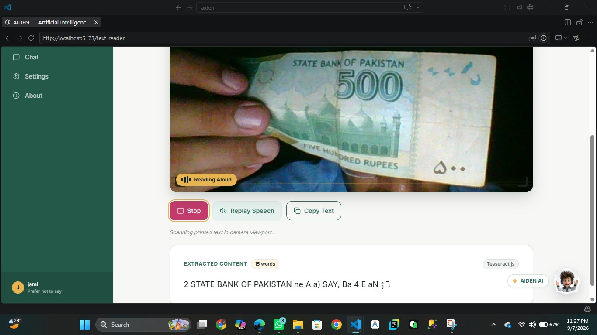
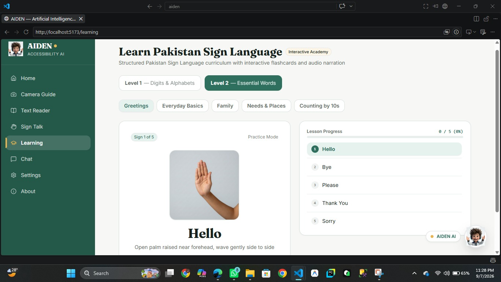
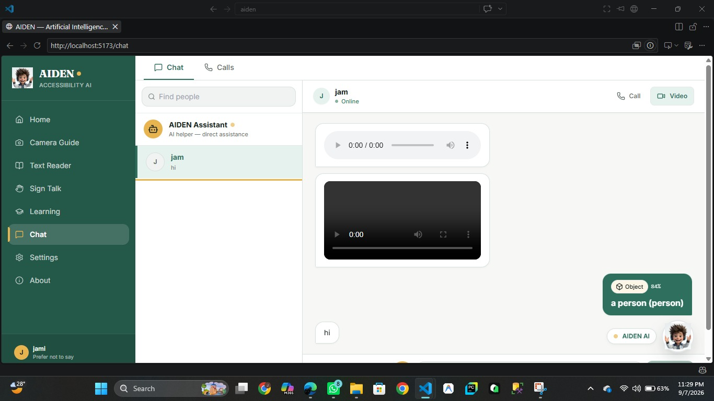
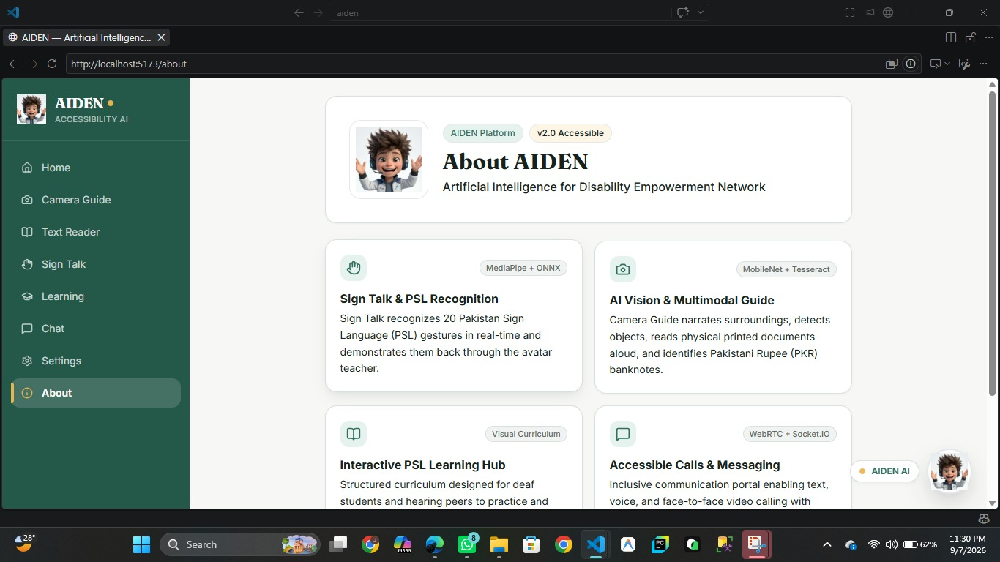

# AIDEN — Visual Tour & Screenshot Showcase
> Real captures from the live AIDEN assistive platform, running 100% on-device in the browser.

All images are saved in the local `screenshots/` directory.

---

## 1. Home Dashboard — Welcome & Fast Navigation
> **Route**: `/`  
> **What you're looking at**: The main landing hub designed for zero-confusion access. Features one-click action buttons to immediately launch **Camera Vision** or explore **Sign Talk**, followed by our interactive perception pipeline breakdown explaining how AIDEN perceives, understands, and speaks.

*Key Highlights*:
- Clean, fixed-sidebar navigation with high-contrast emerald green theme.
- Interactive avatar companion reacting to current system status.
- Direct launchpad buttons for instant accessibility without digging through menus.

---

## 2. Camera Guide — Real-Time Spatial Object Detection
> **Route**: `/vision`  
> **What you're looking at**: Live computer vision running directly inside the web browser at 30 FPS. AIDEN detects the user (`person 93%`) with high-visibility glowing bounding frames and announces what is in the room.

*Key Highlights*:
- Glowing gold `#E8B44F` bounding box with forest-green label badge.
- Viewfinder HUD showing live FPS and on-device neural model status (`COCO-SSD v2`).
- 100% private: video frames are processed in WebGL memory and never leave the device.

---

## 3. Text Reader OCR — Reading a Real 500 PKR Banknote
> **Route**: `/text-reader`  
> **What you're looking at**: Real-world assistive reading in action. A 500 Pakistani Rupee note is held in front of the camera, and AIDEN extracts *"STATE BANK OF PAKISTAN 500"* using client-side Tesseract.js WASM, reading it aloud immediately.

*Key Highlights*:
- Live animated *"Reading Aloud"* audio visualizer badge.
- Instant action controls: **Stop**, **Replay Speech**, and **Copy Text** to clipboard.
- Displays extracted word count and transcribed text for complete verification.

---

## 4. Interactive Sign Academy — Learning PSL Step-by-Step
> **Route**: `/learning`  
> **What you're looking at**: The Pakistan Sign Language learning studio. Demonstrates the Level 2 "Greetings" module with an authentic real-hand demonstration picture for the **"Hello"** sign.

*Key Highlights*:
- Real human hand photography for authentic finger posture reference.
- Plain-language movement instructions: *"Open palm raised near forehead, wave gently side to side"*.
- Interactive lesson progression tracking ($0/5$ completed) and practice audio narration.

---

## 5. Accessible Messaging — Voice Notes, Video & AI Detection Cards
> **Route**: `/chat`  
> **What you're looking at**: An inclusive chat thread between users, showing support for custom accessibility media. Notice the inline audio voice note player, video player snippet, and a shared AI detection card (*"Object 84% — a person"*).

*Key Highlights*:
- Built-in audio voice note player with scrubbable waveform.
- Video message preview player.
- Instant camera detection sharing: users can drop recognized signs, currency, or objects directly into conversations.
- Quick buttons to start WebRTC encrypted voice or video calls.

---

## 6. About AIDEN — Architecture & Platform Pillars
> **Route**: `/about`  
> **What you're looking at**: The architectural overview detailing AIDEN's four core technological pillars: Sign Talk (MediaPipe + ONNX), AI Vision (MobileNet + Tesseract), PSL Learning Hub, and Accessible Calls (WebRTC + Socket.io).

*Key Highlights*:
- Highlights our commitment to v2.0 accessibility standards.
- Clearly states the lightweight, browser-native machine learning models powering each feature.
- Built specifically for Pakistan's differently-abled community.
